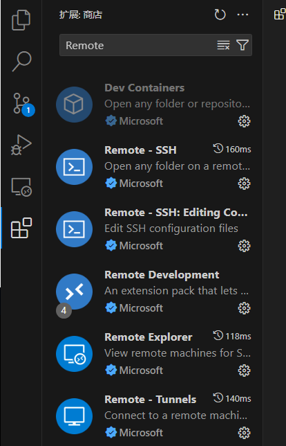
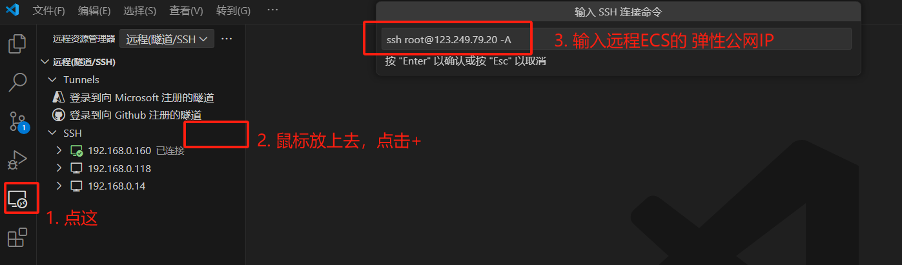
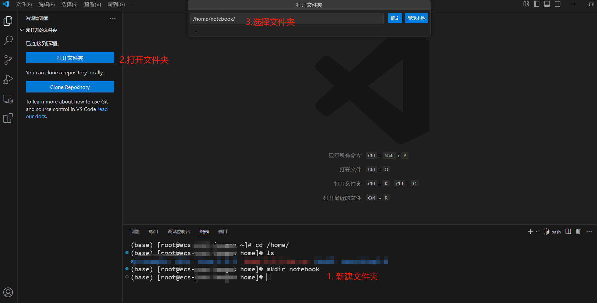
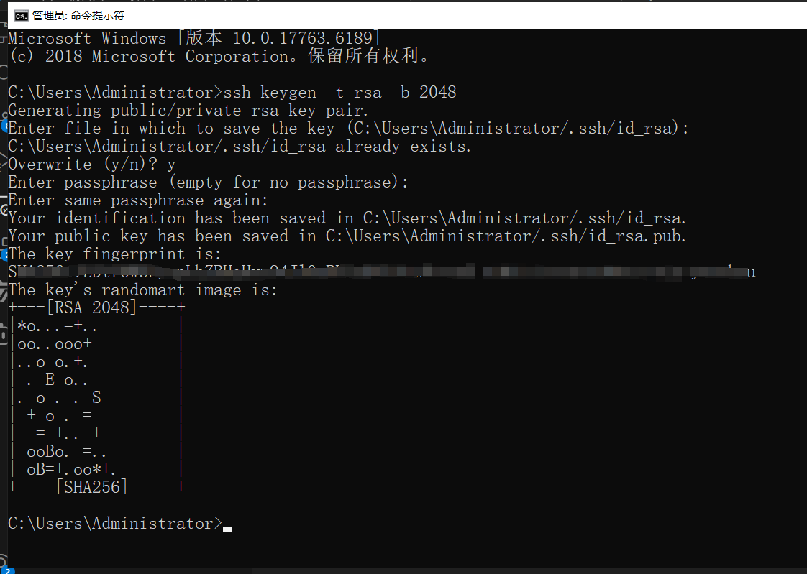
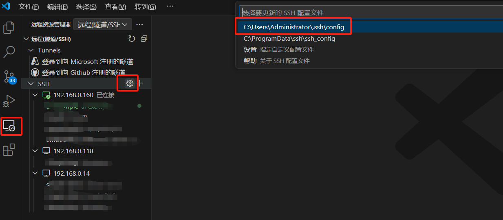
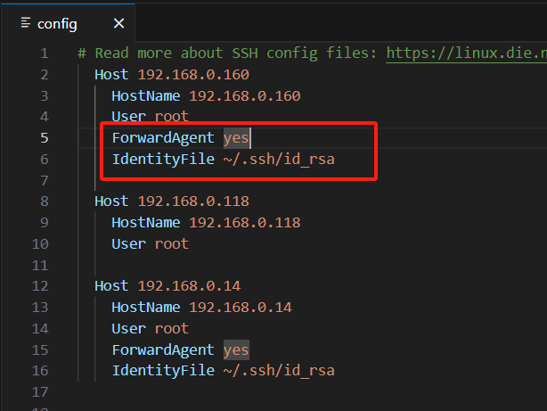

### 云上Notebook+本地VS Code搭建远程开发环境

#### 环境准备

##### 华为云ECS

如果还未购买请参照 [0.购买ECS&SSH连接](0.购买ECS&SSH连接.md)

##### 本地安装 VS Code

| 项目     | 内容                                                         | 说明                       |
| -------- | ------------------------------------------------------------ | -------------------------- |
| 操作系统 | Window 10                                                    | 其他操作系统请自行搜索教程 |
| 下载地址 | [x64](https://update.code.visualstudio.com/1.99.3/win32-x64-user/stable) [Arm64](https://update.code.visualstudio.com/1.99.3/win32-arm64-user/stable) |                            |
| 安装插件 | Remote - SSH                                                 |                            |

#### 插件安装

##### 远程ECS

- [安装miniconda](升级Python&pip.md)

##### 本地VS Code

- 安装Remote - SSH，会关联安装几个依赖

  

- **配置远程SSH**

  

​	输入ECS的密码

​	至此，本地VS Code通过SSH连接远程ECS就完成了。接下来可通过打开ECS本地文件或Clone一个远程git 仓库到ECS本地两种方式进行开发。

- ##### 新建开发文件夹

  连接上远程ECS后，VS Code的终端默认已经连接上了，可以通过命令新建一个文件夹，用于放置notebook文件。

  文件夹建好后，昨天资源管理器选择打开刚新建的文件夹，就可以进行notebook开发了。

  

- ##### 配置免密登录

  每次登录SSH或打开文件夹都要输入密码，比较繁琐，下面介绍免密登录的设置过程。

  **1.本地打开cmd命令行生成密钥对**

  ```shell
  ssh-keygen -t rsa -b 2048
  ```

  

  公钥文件默认存放在``C:\Users\Administrator/.ssh/id_rsa.pub``

  **2.添加公钥到远程ECS**

  通过VS Code终端在远程ECS新建``authorized_keys``文件

  ```shell
  mkdir ~/.ssh
  cd ~/.ssh
  vim authorized_keys
  ```

  用记事本打开 ``C:\Users\Administrator/.ssh/id_rsa.pub`` 将内容复制到authorized_keys文件中，然后保存authorized_keys。

  **3.配置VS Code SSH客户端**

  

  在config文件中指定的Host配置块下，增加如下配置项

  

  再次打开文件夹，发现不用再输入密码了。