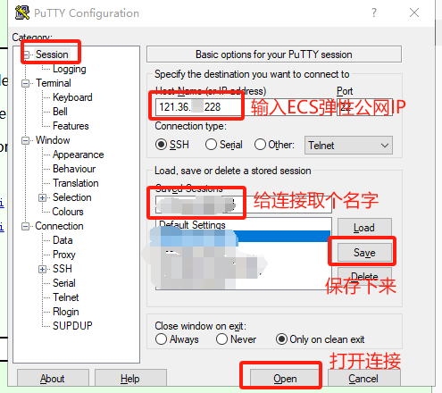

#### 华为云购买ECS规格推荐

| 项目           | 内容                                              | 说明                         |
| -------------- | ------------------------------------------------- | ---------------------------- |
| **计费模式**   | 按需计费                                          | 不用时可以关机，节省费用支出 |
| **实例规格**   | 鲲鹏通用计算增强型 \|kc1.xlarge.4 \|4vCPUs\|16GiB | 根据场景可动态变更规格       |
| **操作系统**   | 镜像: Huawei Cloud EulerOS 2.0 标准版 64位 ARM版  |                              |
| **存储与备份** | 系统盘: 通用型SSD, 40GiB                          | 支持动态扩容                 |
| **网络**       | 虚拟私有云                                        | 提前创建VPC                  |
| **安全组**     | **安全组放开SSH（22）端口**                       | **务必放开否则SSH无法连接**  |
| **公网访问**   | 弹性公网IP: 全动态BGP \|按带宽计费 \|10Mbit/s     |                              |
| **配置费用**   | ¥0.8488/小时 + 弹性公网IP流量费用 ¥0.80/GB        | 实际扣费以账单为准           |

#### SSH工具PUTTY连接

[下载地址](https://www.chiark.greenend.org.uk/~sgtatham/putty/latest.html)，根据本地操作系统选择对应安装包

**配置SSH**

