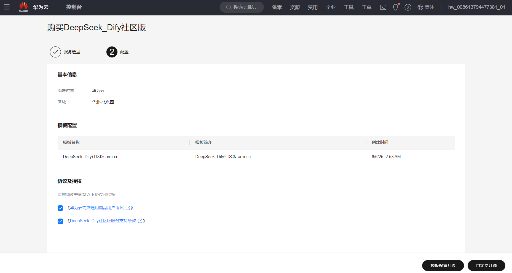
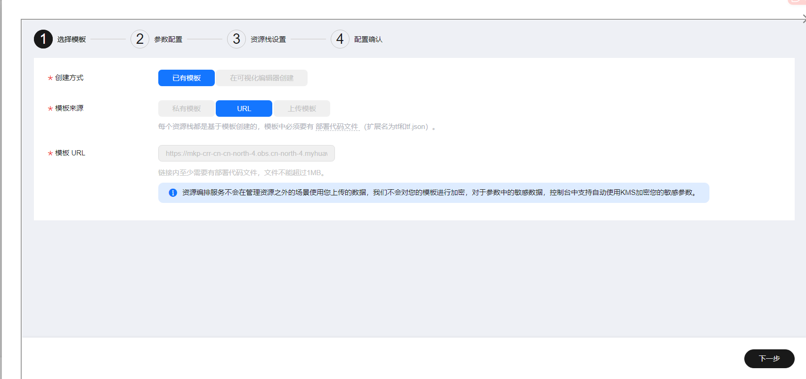
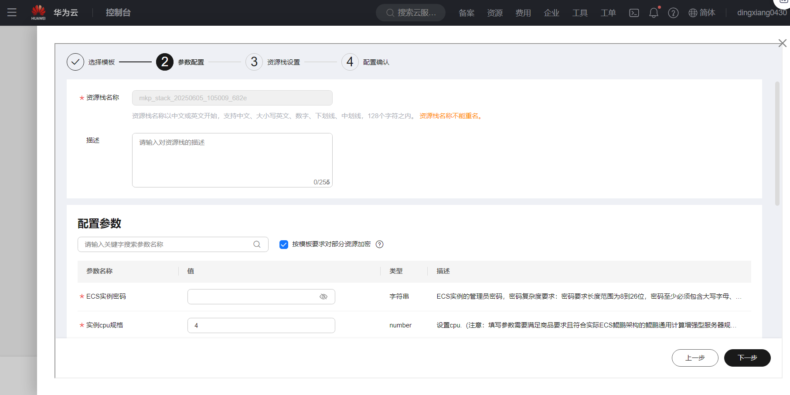
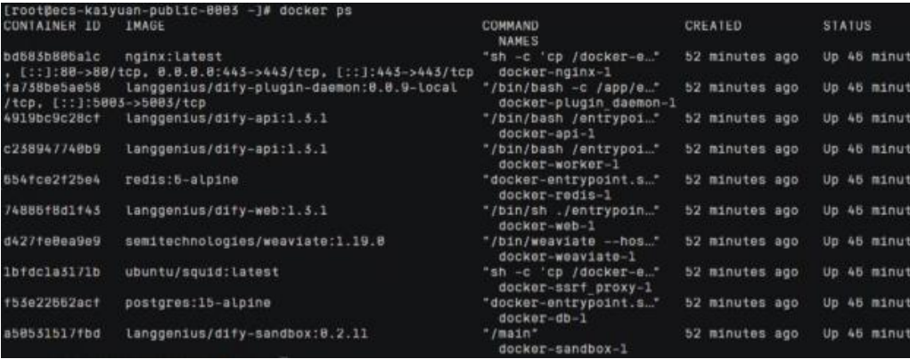
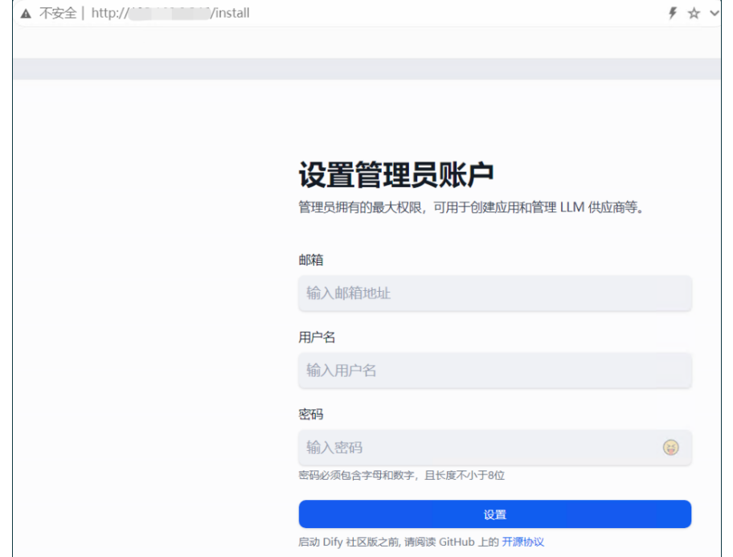
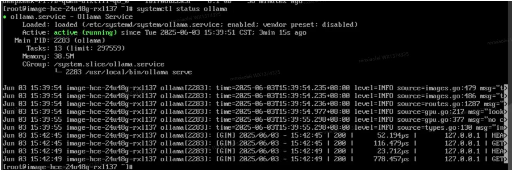

# DeepSeek_Dify社区版工具使用指南
## 商品连接
[DeepSeek_Dify社区版](https://marketplace.huaweicloud.com/contents/c2624f6f-2e5e-4e0e-813a-832bd101101e#productid=OFFI1137707809154215936)

## 商品说明
DeepSeek-R1是一个高性能的AI推理模型，专注于数学、代码和自然语言推理任务，通过
Ollama在云服务器中部署DeepSeek-R1蒸馏版轻量模型，快速打造您的私人AI助手。适用
场景包括：自然语言处理（NLP）：能够理解和生成自然语言文本，适用于对话、翻译、
摘要等任务；文本生成：能够生成连贯、逻辑清晰的文本，适用于内容创作、故事编写
等；问答系统：能够回答用户提出的问题，适用于客服、知识库查询等场景；情感分析：
能够分析文本中的情感倾向，适用于市场调研、舆情监控等；文本分类：能够对文本进行
分类，适用于垃圾邮件过滤、新闻分类等；信息抽取：能够从文本中提取关键信息，适用
于数据挖掘、知识图谱构建等。 
Dify 是一款开源的大语言模型(LLM) 应用开发平台。它融合了后端即服务（Backend as
Service）和 LLMOps 的理念，使开发者可以快速搭建生产级的生成式 AI 应用。即使你
是非技术人员，也能参与到 AI 应用的定义和数据运营过程中。
由于 Dify 内置了构建 LLM 应用所需的关键技术栈，包括对数百个模型的支持、直观的
Prompt 编排界面、高质量的 RAG 引擎、稳健的 Agent 框架、灵活的流程编排，并同时
提供了一套易用的界面和 API。这为开发者节省了许多重复造轮子的时间，使其可以专注
在创新和业务需求上。 
本商品在鲲鹏云的上Ubuntu24.04和HCE2.0系统中进行安装后以镜像提供给
用户使用。

## 商品购买
您可以在云商店搜索“DeepSeek_Dify社区版”。 
其中，地域、规格、按照推荐配置使用，购买方式根据您的需求选择按需/按月/按年，短
期使用推荐按需，长期使用推荐按月/按年，确认配置后点击“立即购买”。

### 使用 RFS 模板直接部署

必填项填写后，点击 下一步

创建直接计划后，点击 确定

点击部署，执行计划

如下图“Apply required resource success. ”即为资源创建完成

### ECS控制台配置
#### 准备工作

在使用ECS控制台配置前，需要您提前配置好 **安全组规则**。

> **安全组规则的配置如下：**
> - 入方向规则放通端口80，源地址内必须包含您的客户端ip，否则无法访问
> - 入方向规则放通 CloudShell 连接实例使用的端口 `22`，以便在控制台登录调试
> - 出方向规则一键放通

#### 创建ECS

前提工作准备好后，选择 ECS 控制台配置跳转到[购买ECS](https://support.huaweicloud.com/qs-ecs/ecs_01_0103.html) 页面，ECS 资源的配置如下图所示：

选择CPU架构

选择服务器规格

选择镜像

其他参数根据实际请客进行填写，填写完成之后，点击立即购买即可

> **值得注意的是：**
- VPC 您可以自行创建
- 安全组选择 [**准备工作**](#准备工作) 中配置的安全组；
- 弹性公网IP选择现在购买，推荐选择“按流量计费”，带宽大小可设置为5Mbit/s；
- 高级配置需要在高级选项支持注入自定义数据，所以登录凭证不能选择“密码”，选择创建后设置；
- 其余默认或按规则填写即可。

 ## 商品使用
 ### 登录服务器查看 Dify 进程
- 进入系统后通过命令docker ps查看Dify进程如下

- 通过浏览器登录 Dify 平台
   初次登录平台地址： http://your ip/install
   

### 配置 DeepSeek-R1 推理服务
- 通过命令 systemctl status ollama 查看服务状态，确保服务已经启动，模型名称
deepseek-r1:7b-qwen-distill-q8_0

### 完整参考 Dify 手册
[Dify手册](https://docs.dify.ai/zh-hans/development/models-integration/ollama)