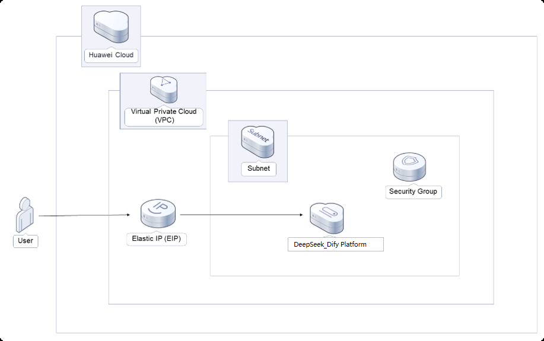

  <h1 align="center">DeepSeek_Dify Community Edition Platform</h1>
  

    <strong>English</strong> | <a href="README_ZH.md">简体中文</a>
  

## Table of Contents

- [Repository Introduction](#repository-introduction)
- [Prerequisites](#prerequisites)
- [Image Description](#image-description)
- [Getting Help](#getting-help)
- [How to Contribute](#how-to-contribute)

## Repository Introduction
[DeepSeek-R1](https://github.com/deepseek-ai/DeepSeek-R1) is a high-performance AI inference model focused on mathematical, coding, and natural language reasoning tasks. By deploying the distilled lightweight version of DeepSeek-R1 via Ollama on a cloud server, you can quickly create your personal AI assistant.  
[Dify](https://dify.ai/zh) is an open-source large language model (LLM) application development platform.  

**Project Architecture**
 This solution helps you quickly deploy a private DeepSeek Dify Community Edition application development platform. 

**Core Features:**  
Applicable scenarios include:  
- Natural Language Processing (NLP): Capable of understanding and generating natural language text, suitable for dialogue, translation, summarization, and other tasks.  
- Text Generation: Able to produce coherent and logically clear text, ideal for content creation, story writing, etc.  
- Q&A Systems: Can answer user queries, suitable for customer service, knowledge base searches, and similar scenarios.  
- Sentiment Analysis: Capable of analyzing emotional tendencies in text, useful for market research, public opinion monitoring, etc.  
- Text Classification: Can categorize text, applicable for spam filtering, news classification, etc.  
- Information Extraction: Able to extract key information from text, suitable for data mining, knowledge graph construction, etc.  

This project provides an open-source image product [**DeepSeek_Dify Community Edition Platform**](https://marketplace.huaweicloud.com/contents/c2624f6f-2e5e-4e0e-813a-832bd101101e#productid=OFFI1137707809154215936), pre-installed with DeepSeek-R1's inference environment, Dify Community Edition, and related runtime environments, along with deployment templates. Follow the user guide for an efficient "out-of-the-box" experience.  

> **System Requirements:**  
> - CPU: 8 vCPUs or higher  
> - RAM: 16GB or more  
> - Disk: At least 40GB  

## Prerequisites
[Register a Huawei account and activate Huawei Cloud](https://support.huaweicloud.com/usermanual-account/account_id_001.html)  

## Image Description

| Image Specification | Feature Description | Remarks |
|---------------------|--------------------|---------|
| [DeepSeek7B-Dify1.4.1-Ubuntu-Kunpeng-v1.0](https://marketplace.huaweicloud.com/contents/c2624f6f-2e5e-4e0e-813a-832bd101101e#productid=OFFI1137707809154215936) | Deployed on Kunpeng Cloud Server + Ubuntu 24.04 64bit |  |
| [DeepSeek7B-Dify1.4.1-HCE-Kunpeng-v1.0](https://marketplace.huaweicloud.com/contents/c2624f6f-2e5e-4e0e-813a-832bd101101e#productid=OFFI1137707732705042432) | Deployed on Kunpeng Cloud Server + Huawei Cloud EulerOS 2.0 64bit |  |

## Getting Help
- For more issues, contact us via [GitHub Issues](https://github.com/HuaweiCloudDeveloper/dify-tools/issues) or Huawei Cloud Marketplace support for the specified product.  
- Other open-source images can be found at [open-source-image-repos](https://github.com/HuaweiCloudDeveloper/open-source-image-repos).  

## How to Contribute
- Fork this repository and submit a pull request.  
- Synchronize updates to README.md based on your open-source image information.  