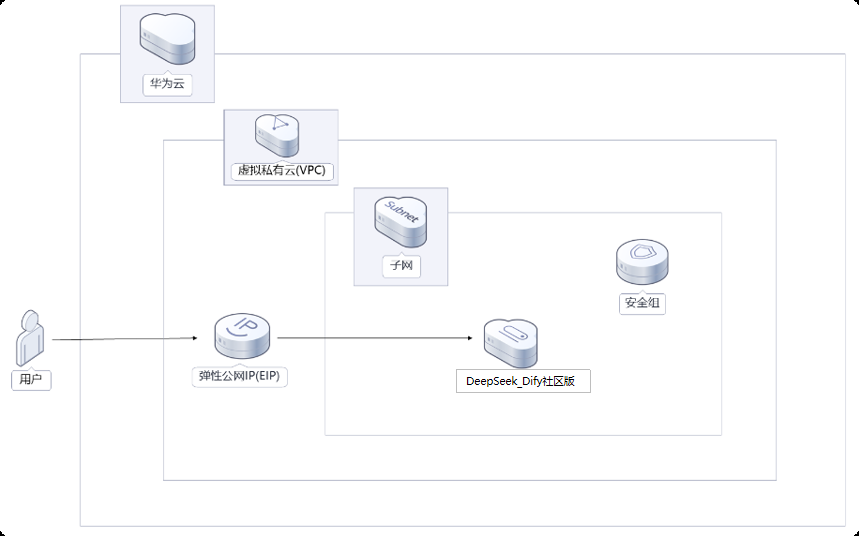

  <h1 align="center">DeepSeek_Dify社区版平台</h1>
  

    <a href="README.md"><strong>English</strong></a> | <strong>简体中文</strong>
  

## 目录

- [仓库简介](#项目介绍)
- [前置条件](#前置条件)
- [镜像说明](#镜像说明)
- [获取帮助](#获取帮助)
- [如何贡献](#如何贡献)

## 项目介绍
[DeepSeek-R1](https://github.com/deepseek-ai/DeepSeek-R1)是一个高性能的AI推理模型，专注于数学、代码和自然语言推理任务，通过Ollama在云服务器中部署DeepSeek-R1蒸馏版轻量模型，快速打造您的私人AI助手。 
[Dify](https://dify.ai/zh)是一款开源的大语言模型(LLM)应用开发平台。

**项目部署架构**
 该方案帮助你快速部署私有的DeepSeek Dify社区版应用开发平台。 

**核心特性：**
适用场景包括：
- 自然语言处理（NLP）：能够理解和生成自然语言文本，适用于对话、翻译、摘要等任务；
- 文本生成：能够生成连贯、逻辑清晰的文本，适用于内容创作、故事编写等；
- 问答系统：能够回答用户提出的问题，适用于客服、知识库查询等场景；
- 情感分析：能够分析文本中的情感倾向，适用于市场调研、舆情监控等；
- 文本分类：能够对文本进行分类，适用于垃圾邮件过滤、新闻分类等；
- 信息抽取：能够从文本中提取关键信息，适用于数据挖掘、知识图谱构建等。

本项目提供的开源镜像商品 [**DeepSeek_Dify社区版平台**](https://marketplace.huaweicloud.com/contents/c2624f6f-2e5e-4e0e-813a-832bd101101e#productid=OFFI1137707809154215936)，已预先安装 DeepSeek-R1的推理环境、 Dify社区版 及其相关运行环境，并提供部署模板。快来参照使用指南，轻松开启“开箱即用”的高效体验吧。

> **系统要求如下：**
> - CPU: 8vCPUs 或更高
> - RAM: 16GB 或更大
> - Disk: 至少 40GB

## 前置条件
[注册华为账号并开通华为云](https://support.huaweicloud.com/usermanual-account/account_id_001.html)

## 镜像说明

| 镜像规格                                                                                                                                 | 特性说明                                           | 备注 |
|--------------------------------------------------------------------------------------------------------------------------------------|------------------------------------------------| --- |
| [DeepSeek7B-Dify1.4.1-Ubuntu-鲲鹏-v1.0](https://marketplace.huaweicloud.com/contents/c2624f6f-2e5e-4e0e-813a-832bd101101e#productid=OFFI1137707809154215936) | 基于 鲲鹏云服务器 + Ubuntu 24.04 64bit 安装部署 |  |
| [DeepSeek7B-Dify1.4.1-HCE-鲲鹏-v1.0](https://marketplace.huaweicloud.com/contents/c2624f6f-2e5e-4e0e-813a-832bd101101e#productid=OFFI1137707732705042432) | 基于 鲲鹏云服务器 + Huawei Cloud EulerOS 2.0 64bit 安装部署 |  |

## 获取帮助
- 更多问题可通过 [issue](https://github.com/HuaweiCloudDeveloper/dify-tools/issues) 或 华为云云商店指定商品的服务支持 与我们取得联系
- 其他开源镜像可看 [open-source-image-repos](https://github.com/HuaweiCloudDeveloper/open-source-image-repos)

## 如何贡献
- Fork 此存储库并提交合并请求
- 基于您的开源镜像信息同步更新 README.md
