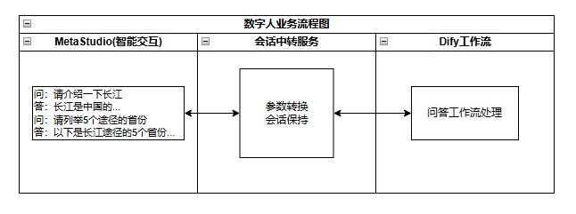
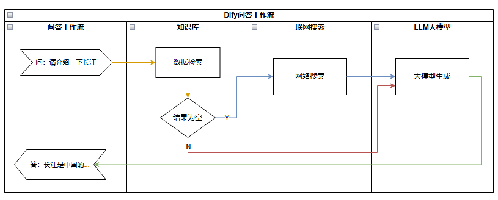

# 数字人交互智能问答解决方案

该方案基于华为云数字内容生产线MetaStudio、AI开发平台ModelArts、云搜索服务CSS和Dify快速部署数字人交互服务，部署后用户只需简单配置几项关键参数即可直接使用数字人交互服务。

## 架构图

## 流程图

## 方案优势
- 开箱即用：快速部署，用户只需填写必要参数，几个步骤即可使用智能数字人交互解决方案。
- 低成本：提供高性价比的云服务器，用户可以根据实际需求自定义不同规格的云服务器。
- 一键部署：一键轻松部署，即可完成智能数字人交互解决方案搭建。免去用户注册及复杂的配置。

## 构建指南
详见 [构建指南](build.md)

## 部署指南
详见 [部署指南](deploy.md)

## 使用指南
详见 [使用指南](usage.md)