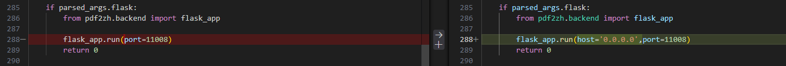
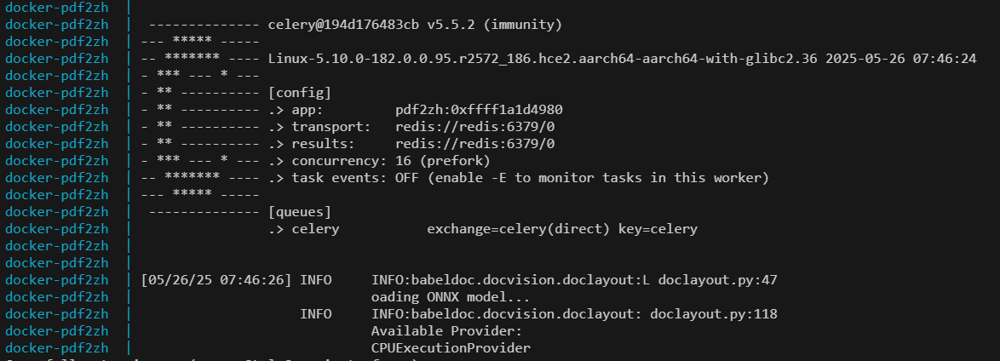

pdf2zh 官方提供了一个docker的镜像，但这个镜像只能作为一个web页面服务，并没有对外暴露REST API，如果需要在Dify工作流中调用，还需要自己构建镜像，下面是最佳实践。

#### 前提

- Docker运行环境
- UV环境，python 3.12

#### 下载源码

```shell
https://github.com/Byaidu/PDFMathTranslate.git
cd PDFMathTranslate
```

#### 安装pdf2zh工具

安装pdf2zh工具是为了下载字体、模型等依赖

```shell
export HF_ENDPOINT=https://hf-mirror.com
export UV_DEFAULT_INDEX=https://pypi.tuna.tsinghua.edu.cn/simple
export UV_HTTP_TIMEOUT=1800
uv tool install pdf2zh
pdf2zh -i
```

浏览器输入``http://127.0.0.1:7860``,上传一个简单的pdf文件，例如：``test/file/translate.cli.plain.text.pdf``

#### 修改源文件

默认``pdf2zh.backend``只绑定了``127.0.0.1``，如果在docker容器中，外部是无法访问的，所以要改成``0.0.0.0``，文件地址：``pdf2zh/pdf2zh.py``



#### 重新编译源文件

在项目目录下执行``uv build``，默认会在当前目录下创建``dist``目录，里面包含了：

```shell
pdf2zh-1.9.9.tar.gz
pdf2zh-1.9.9-py3-none-any.whl
```

#### 构建Docker镜像

在项目目录下创建``build``目录，进入``build``目录

##### 1.复制文件

```shell
cp ../dist/pdf2zh-1.9.9-py3-none-any.whl .
cp -r ~/.cache/babeldoc/fonts ./babeldoc
cp -r ~/.cache/babeldoc/models ./babeldoc
cp -r ~/.cache/babeldoc/tiktoken ./babeldoc
```

##### 2.创建``Dockerfile``

```shell
FROM python:3.12-slim

RUN sed -i 's/http:\/\/deb.debian.org\//https:\/\/mirrors.huaweicloud.com\//g' /etc/apt/sources.list.d/debian.sources

RUN apt-get update && \
     apt-get install --no-install-recommends -y libgl1 libglib2.0-0 libxext6 libsm6 libxrender1 && \
     rm -rf /var/lib/apt/lists/*

ENV UV_DEFAULT_INDEX=https://pypi.tuna.tsinghua.edu.cn/simple
ENV UV_HTTP_TIMEOUT=1800
ENV HF_ENDPOINT=https://hf-mirror.com
ENV PATH=$PATH:/root/.local/bin

RUN pip config set global.index-url https://repo.huaweicloud.com/repository/pypi/simple 
RUN pip install --upgrade pip && pip install uv 

WORKDIR /app

RUN mkdir -p /root/.cache
COPY run.sh .
COPY pdf2zh-1.9.9-py3-none-any.whl .
COPY ./babeldoc /root/.cache/babeldoc

RUN uv tool install --with pdf2zh-1.9.9-py3-none-any.whl pdf2zh[backend]

CMD ["/bin/bash"]
```

执行以下命令构建docker镜像

```shell
docker build -f Dockerfile -t pdf2zh-api-server:1.9.9 .
```

#### 启动Docker镜像

默认``Celery``依赖redis，简便起见，使用``docker compose``方式最好。

##### 1.创建``run.sh``

```shell
#!/bin/bash
# 启动 Celery worker（后台运行）
pdf2zh --celery worker &
# 启动 Flask（前台运行）
pdf2zh --flask &
# 启动 Web UI
pdf2zh -i
```

##### 2.创建``docker-compose.yaml``

```shell
services:
    redis:
        container_name: docker-redis
        image: redis:alpine
        command: redis-server
        ports:
            - 6379:6379
        volumes:
            - ./data/redis:/data
        healthcheck:
            test: [ 'CMD', 'redis-cli', 'ping' ]

    pdf2zh:
        container_name: docker-pdf2zh
        image: pdf2zh-api-server:1.9.9
        privileged: true
        restart: always
        ports:
            - 11008:11008
            - 7860:7860
        command: /bin/bash -c "cd /app && bash run.sh"
        environment:
            CELERY_BROKER: "redis://redis:6379/0"
            CELERY_RESULT: "redis://redis:6379/0"
        depends_on:
            redis:
                condition: service_healthy

networks:
    default:
        name: pdf2zh
```

##### 3.启动

```shell
docker compose up -d
```

通过以上方式我们创建的``pdf2zh-api-server``即支持Web UI访问，也支持HTTP API访问，一举两得。



